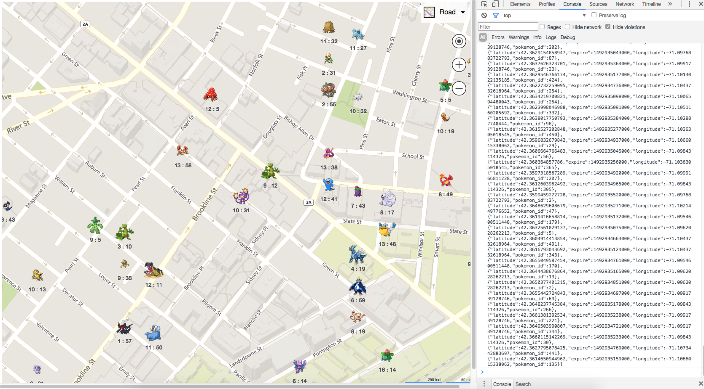
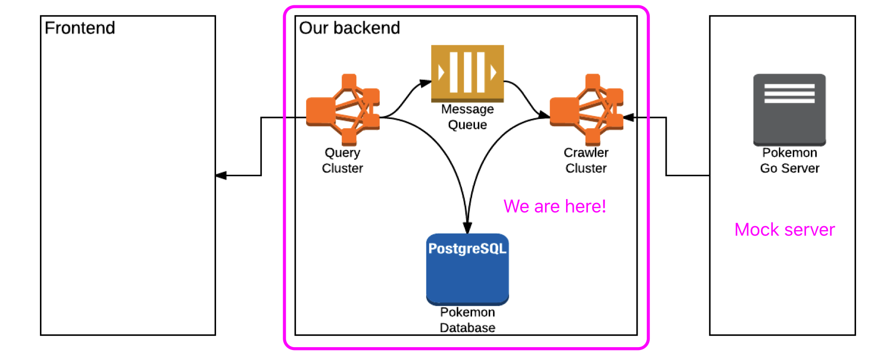

# PokemonGo Map Query Server & Crawler Server

>Disclaimer: This is a POC(proof of concept) project improved from [chenditic](https://github.com/chenditc)'s original design for education purpose.

## Demo
http://hackjutsu.com/pokemongo-map-poc-demo/

## Data source
All Pokemon data, which are essentially fake, are generated randomly by a [mock API](https://github.com/hackjutsu/mock_pgoapi). In principle, there is no communction between the crawlers and the real Pokemon Go servers.

## System Architecture

A distributed crawler system that achieves heuristic data crawling based on geographical location information, said system comprising: 

1. A web app sends network requests with said geographical locations information to an API gateway,
2. An API gateway subsystem constructed by said API gateways, routes said requests to a query cluster,
3. A query subsystem constructed by said query cluster, queries for Pokemons data based on said geographical locations information from a database on AWS, and returns said Pokemon data to said web app, and sends said geographical locations information to message queues,
4. A message queue subsystem constructed from said message queues, stores said messages from said query subsystem, and provides said messages to a crawler cluster
5. A crawler subsystem constructed by said crawler cluster, retrieves said geographical locations information from said message queue subsystem, and gets fake Pokemons data from a mock Pokemon go API, and saves said fake Pokemons data to a database,
4. A database subsystem constructed by said database, stores said Pokemons data.

>This repository composes of an implemenation for the query server and an implementation of the crawler server. An implementation for the web app can be found [here](https://github.com/hackjutsu/pokemongo-map-poc-demo).

## Resource
- [mock pkgoapi](https://github.com/hackjutsu/mock_pgoapi)
- [pokemonGo map webapp boilerplate](https://github.com/hackjutsu/pokemon-go-map-boilerplate)

## License
[MIT](./LICENSE)
